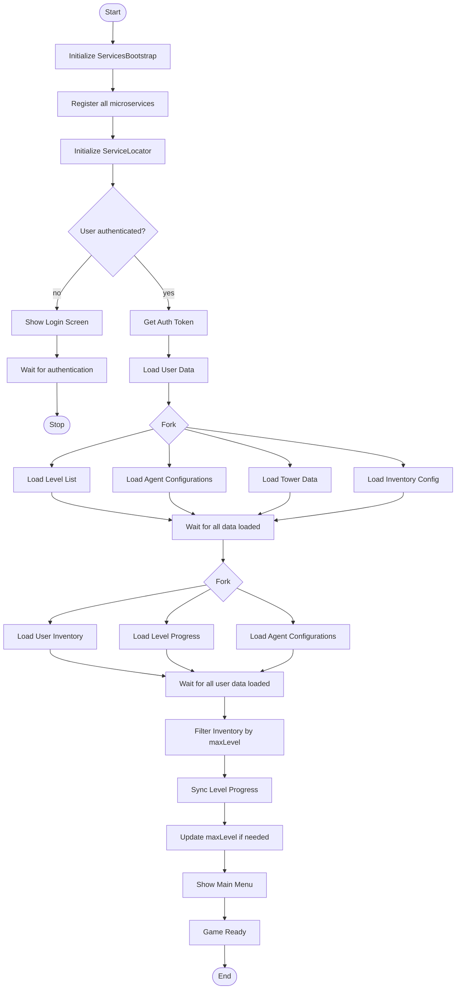

# Microservice Architecture - Activity Diagram

## PlantUML Diagrams

File: `MICROSERVICE_ACTIVITY_DIAGRAM.puml`

Để xem diagram, bạn có thể:
1. Sử dụng [PlantUML Online Editor](http://www.plantuml.com/plantuml/uml/)
2. Cài đặt extension PlantUML trong VS Code
3. Sử dụng IntelliJ IDEA với PlantUML plugin

## Tổng quan

File PlantUML chứa **6 activity diagrams** chính mô tả các luồng hoạt động quan trọng trong hệ thống:

1. **Start Game Flow** - Khởi động game và load dữ liệu
2. **Play Level Flow** - Luồng chơi level với các state transitions
3. **Complete Level Flow** - Hoàn thành level và unlock towers
4. **Inventory Management Flow** - Quản lý inventory của player
5. **Authentication Flow** - Xác thực người dùng
6. **Filter Tower Library Flow** - Lọc tower library dựa trên selected towers

## 1. Start Game Flow

Mô tả quá trình khởi động game từ đầu đến khi sẵn sàng chơi.

### Các bước chính:
1. **Initialize Services**: Khởi tạo ServicesBootstrap và đăng ký tất cả microservices
2. **Authentication Check**: Kiểm tra xem user đã đăng nhập chưa
3. **Load Game Data**: Load song song các dữ liệu game (Level List, Agent Config, Tower Data, Inventory Config)
4. **Load User Data**: Load song song dữ liệu user (Inventory, Level Progress, Agent Configurations)
5. **Filter & Sync**: Lọc inventory theo maxLevel và đồng bộ dữ liệu
6. **Show Main Menu**: Hiển thị main menu, game sẵn sàng

### Điểm nổi bật:
- Sử dụng **fork/join** để load dữ liệu song song
- Kiểm tra authentication trước khi load user data
- Tự động filter inventory dựa trên maxLevel

## 2. Play Level Flow

Mô tả luồng chơi level từ khi chọn level đến khi kết thúc.

### Level States:
- **Intro**: Màn hình giới thiệu level
- **Building**: Phase xây dựng towers
- **SpawningEnemies**: Phase spawn enemies và combat
- **AllEnemiesSpawned**: Tất cả enemies đã spawn
- **Win**: Thắng level
- **Lose**: Thua level

### Các bước chính:
1. **Load Level Data**: Load Level Library Config và User Inventory
2. **Filter Tower Library**: Lọc tower library dựa trên selected towers và maxLevel
3. **Initialize Level**: Load scene, khởi tạo LevelManager
4. **Building Phase**: Player xây dựng towers
5. **Combat Phase**: Spawn enemies, towers tấn công, enemies di chuyển
6. **Check Win/Lose**: Kiểm tra điều kiện thắng/thua

### Điểm nổi bật:
- Sử dụng **fork** để xử lý song song: spawn enemies, towers attack, currency gain
- State machine rõ ràng với các transitions
- Filter tower library trước khi vào level

## 3. Complete Level Flow

Mô tả quá trình hoàn thành level và các hành động sau đó.

### Các bước chính:
1. **Calculate Results**: Tính stars và xác định Win/Lose
2. **Save Progress**: Lưu level progress vào Firestore và local storage
3. **Unlock Tower**: Tự động unlock tower mới dựa trên level index
4. **Sync Data**: Đồng bộ dữ liệu và filter inventory

### Logic Unlock Tower:
- **Level 0 (Level 1)**: Unlock Rocket
- **Level 1 (Level 2)**: Unlock Emp
- **Level 2 (Level 3)**: Unlock Laser

### Điểm nổi bật:
- Tự động unlock tower khi complete level
- Kiểm tra xem user đã sở hữu tower chưa
- Tự động filter inventory sau khi unlock

## 4. Inventory Management Flow

Mô tả quá trình quản lý inventory của player.

### Các bước chính:
1. **Load Inventory**: Load từ cache hoặc Firestore
2. **Select Towers**: Player chọn tối đa 3 towers
3. **Unlock Tower**: Unlock tower mới (nếu đủ điều kiện)
4. **Filter Inventory**: Lọc inventory dựa trên maxLevel

### Validation:
- Tối đa 3 towers có thể được chọn
- Kiểm tra ownership trước khi select
- Kiểm tra unlock requirements trước khi unlock

### Điểm nổi bật:
- Validate selection (max 3 towers)
- Check unlock requirements trước khi unlock
- Tự động filter và remove locked towers

## 5. Authentication Flow

Mô tả quá trình xác thực người dùng.

### Các phương thức:
- **Google Sign In**: Đăng nhập bằng Google
- **Email/Password Sign In**: Đăng nhập bằng email/mật khẩu
- **Email/Password Sign Up**: Đăng ký tài khoản mới

### Các bước chính:
1. **Check Authentication**: Kiểm tra xem user đã đăng nhập chưa
2. **Show Login Screen**: Hiển thị màn hình đăng nhập
3. **Authenticate**: Xác thực với Firebase
4. **Post Authentication**: Load user data, inventory, level progress
5. **Navigate**: Chuyển đến Main Menu

### Điểm nổi bật:
- Hỗ trợ nhiều phương thức đăng nhập
- Tự động load user data sau khi đăng nhập
- Initialize inventory cho user mới

## 6. Filter Tower Library Flow

Mô tả quá trình lọc tower library dựa trên selected towers và maxLevel.

### Các bước chính:
1. **Load Data**: Load TowerLibraryContainer, get maxLevel, load inventory
2. **Get Unlocked Types**: Xác định các tower types đã unlock
3. **Get Selected Towers**: Lấy danh sách towers đã chọn (isSelected = true)
4. **Load Source Towers**: Load từ library và Resources
5. **Match & Filter**: Match towers theo name hoặc type, filter theo unlocked + selected

### Matching Strategy:
1. **Match by towerName**: So sánh tên tower
2. **Match by MainTower type**: So sánh theo MainTower enum

### Điểm nổi bật:
- Dual matching strategy (name + type)
- Tránh duplicate matches
- Chỉ giữ lại towers vừa unlocked vừa selected

## Mermaid Diagrams (Alternative)

### Start Game Flow

### Play Level Flow (Simplified)

```mermaid
flowchart TD
    Start([Start]) --> Select[Player selects level]
    Select --> LoadLevelData[Load Level Library Config]
    LoadLevelData --> LoadInventory[Load User Inventory]
    LoadInventory --> GetSelected[Get Selected Towers max 3]
    
    GetSelected --> GetUnlocked[Get unlocked tower types]
    GetUnlocked --> LoadPrefabs[Load tower prefabs]
    LoadPrefabs --> Filter[Filter library to selected + unlocked]
    
    Filter --> LoadScene[Load Level Scene]
    LoadScene --> InitLevel[Initialize LevelManager]
    InitLevel --> SetCurrency[Set starting currency]
    SetCurrency --> InitBases[Initialize home bases]
    InitBases --> SetIntro[Set levelState = Intro]
    
    SetIntro --> HasIntro{Has Intro?}
    HasIntro -->|yes| ShowIntro[Show Level Intro]
    ShowIntro --> WaitIntro[Wait for intro completion]
    HasIntro -->|no| Building
    WaitIntro --> Building[Change levelState = Building]
    
    Building --> BuildPhase[Building Phase]
    BuildPhase --> PlaceTower[Player places tower]
    PlaceTower --> CheckCurrency[Check currency]
    CheckCurrency --> Deduct[Deduct cost]
    Deduct --> SpawnTower[Spawn tower]
    SpawnTower --> StartWave{Player clicks Start Wave?}
    StartWave -->|no| PlaceTower
    StartWave -->|yes| Spawning[Change levelState = SpawningEnemies]
    
    Spawning --> Fork{Fork}
    Fork --> SpawnEnemies[Spawn enemies in waves]
    Fork --> TowersAttack[Towers attack enemies]
    Fork --> UpdateCurrency[Update currency gain]
    
    SpawnEnemies --> CheckState[Check game state]
    TowersAttack --> CheckState
    UpdateCurrency --> CheckState
    CheckState --> GameOver{Game not over?}
    GameOver -->|no| CheckState
    GameOver -->|yes| AllSpawned[All enemies spawned]
    
    AllSpawned --> CheckWin{All enemies killed?}
    CheckWin -->|yes| Win[Change levelState = Win]
    CheckWin -->|no| CheckLose{All bases destroyed?}
    CheckLose -->|yes| Lose[Change levelState = Lose]
    CheckLose -->|no| WaitKill[Wait for all enemies killed]
    WaitKill --> Win
    
    Win --> End([End])
    Lose --> End
```

## Key Concepts

### Fork/Join
- Sử dụng để xử lý song song các tác vụ độc lập
- Ví dụ: Load multiple data sources simultaneously

### Decision Points
- Kiểm tra điều kiện để quyết định luồng tiếp theo
- Ví dụ: User authenticated?, Requirements met?

### Loops
- Repeat-while loops cho các tác vụ lặp lại
- Ví dụ: Check game state until game over

### Partitions
- Nhóm các activities theo domain/service
- Giúp dễ đọc và hiểu flow

## Best Practices

1. **Parallel Loading**: Load dữ liệu song song khi có thể để tối ưu performance
2. **Validation**: Validate input và điều kiện trước khi thực hiện action
3. **Error Handling**: Xử lý lỗi và fallback scenarios
4. **State Management**: Quản lý state transitions rõ ràng
5. **Event-Driven**: Sử dụng events để notify các components khác

