# Microservice Architecture - Class Diagram

## PlantUML Diagram

File: `MICROSERVICE_CLASS_DIAGRAM.puml`

Để xem diagram, bạn có thể:
1. Sử dụng [PlantUML Online Editor](http://www.plantuml.com/plantuml/uml/)
2. Cài đặt extension PlantUML trong VS Code
3. Sử dụng IntelliJ IDEA với PlantUML plugin

## Mermaid Diagram (Alternative)

```mermaid
classDiagram
    %% Base Layer
    class IService {
        <<interface>>
        +Initialize()
        +IsInitialized bool
        +Shutdown()
    }
    
    class FirestoreServiceBase {
        <<abstract>>
        #firestore FirebaseFirestore
        #isInitialized bool
        +Initialize()
        +Shutdown()
        #InitializeFirestoreInstance()
        #GetServiceName() string
    }
    
    %% Service Interfaces
    class IAgentConfigurationService {
        <<interface>>
        +LoadAgentConfigurationsAsync() Task
        +FilterByType(type) List
    }
    
    class ITowerDataService {
        <<interface>>
        +LoadTowerLevelDataAsync() Task
        +FilterByType(type) List
    }
    
    class ILevelManagementService {
        <<interface>>
        +LoadLevelListAsync() Task
        +LoadLevelLibraryConfigAsync() Task
        +FilterByLevelId(levelId) List
    }
    
    class IUserDataService {
        <<interface>>
        +SaveUserDataAsync(uid, data) Task
        +LoadUserDataAsync(uid) Task
        +SaveLevelProgressAsync(uid, levelId, stars, maxLevel) Task
        +LoadLevelProgressAsync(uid) Task
    }
    
    class IInventoryService {
        <<interface>>
        +LoadUserInventoryAsync(uid) Task
        +UnlockTowerAsync(uid, towerName) Task
        +SelectTowersAsync(uid, towerNames) Task
        +GetCachedInventory() TowerInventoryData
        +HasTower(towerName) bool
        +OnInventoryLoaded event
        +OnSelectedTowersChanged event
    }
    
    class IInventoryConfigService {
        <<interface>>
        +LoadInventoryConfigAsync() Task
        +GetTowerConfig(towerName) InventoryConfigData
        +CanUnlockTower(towerName, level, currency) bool
        +OnInventoryConfigLoaded event
    }
    
    class IAuthService {
        <<interface>>
        +SignInWithGoogleAsync() Task
        +SignInWithEmailAsync(email, password) Task
        +SignOutAsync() Task
        +IsAuthenticated bool
        +CurrentUser UserInfo
        +GetAuthTokenAsync() Task
        +OnSignInSuccess event
        +OnSignOut event
    }
    
    %% Service Implementations
    class AgentConfigurationService {
        +LoadAgentConfigurationsAsync() Task
        +FilterByType(type) List
        #GetServiceName() string
    }
    
    class TowerDataService {
        +LoadTowerLevelDataAsync() Task
        +FilterByType(type) List
        #GetServiceName() string
    }
    
    class LevelManagementService {
        +LoadLevelListAsync() Task
        +LoadLevelLibraryConfigAsync() Task
        +FilterByLevelId(levelId) List
        #GetServiceName() string
    }
    
    class UserDataService {
        +SaveUserDataAsync(uid, data) Task
        +LoadUserDataAsync(uid) Task
        +SaveLevelProgressAsync(uid, levelId, stars, maxLevel) Task
        +LoadLevelProgressAsync(uid) Task
        #GetServiceName() string
    }
    
    class InventoryService {
        +LoadUserInventoryAsync(uid) Task
        +UnlockTowerAsync(uid, towerName) Task
        +SelectTowersAsync(uid, towerNames) Task
        +GetCachedInventory() TowerInventoryData
        +HasTower(towerName) bool
        #GetServiceName() string
    }
    
    class InventoryConfigService {
        +LoadInventoryConfigAsync() Task
        +GetTowerConfig(towerName) InventoryConfigData
        +CanUnlockTower(towerName, level, currency) bool
        #GetServiceName() string
    }
    
    class FirebaseAuthService {
        +SignInWithGoogleAsync() Task
        +SignInWithEmailAsync(email, password) Task
        +SignOutAsync() Task
        +IsAuthenticated bool
        +CurrentUser UserInfo
        +GetAuthTokenAsync() Task
    }
    
    %% Service Management
    class ServiceLocator {
        -instance ServiceLocator
        -services Dictionary
        +Instance ServiceLocator
        +RegisterService~T~(service) void
        +GetService~T~() T
        +UnregisterService~T~() void
        +IsServiceRegistered~T~() bool
        +InitializeAllServices() void
        +ShutdownAllServices() void
    }
    
    class ServicesBootstrap {
        -autoInitializeOnAwake bool
        +InitializeServices() void
        -InitializeAgentConfigurationService() void
        -InitializeTowerDataService() void
        -InitializeLevelManagementService() void
        -InitializeUserDataService() void
        -InitializeInventoryService() void
        -InitializeInventoryConfigService() void
        -InitializeAuthService() void
    }
    
    %% Game Managers
    class GameManager {
        -levelList LevelList
        -m_DataStore GameDataStore
        +CompleteLevel(levelId, stars) void
        +IsLevelCompleted(levelId) bool
        +GetMaxLevel() int
        +LoadLevelProgressFromDB() void
        +LoadInventoryFromDB() void
        +FilterInventoryIfNeeded() Task
    }
    
    class LevelManager {
        -towerLibrary TowerLibrary
        -levelState LevelState
        -currency Currency
        +IncrementNumberOfEnemies() void
        +DecrementNumberOfEnemies() void
        +BuildingCompleted() void
        +FilterTowerLibraryBySelectedTowers() void
    }
    
    %% Inheritance Relationships
    IService <|.. IAgentConfigurationService
    IService <|.. ITowerDataService
    IService <|.. ILevelManagementService
    IService <|.. IUserDataService
    IService <|.. IInventoryService
    IService <|.. IInventoryConfigService
    IService <|.. IAuthService
    
    FirestoreServiceBase ..|> IService
    FirestoreServiceBase <|-- AgentConfigurationService
    FirestoreServiceBase <|-- TowerDataService
    FirestoreServiceBase <|-- LevelManagementService
    FirestoreServiceBase <|-- UserDataService
    FirestoreServiceBase <|-- InventoryService
    FirestoreServiceBase <|-- InventoryConfigService
    
    IAgentConfigurationService <|.. AgentConfigurationService
    ITowerDataService <|.. TowerDataService
    ILevelManagementService <|.. LevelManagementService
    IUserDataService <|.. UserDataService
    IInventoryService <|.. InventoryService
    IInventoryConfigService <|.. InventoryConfigService
    IAuthService <|.. FirebaseAuthService
    
    %% Composition & Usage
    ServiceLocator o-- IService : manages
    ServicesBootstrap ..> ServiceLocator : uses
    ServicesBootstrap ..> AgentConfigurationService : creates
    ServicesBootstrap ..> TowerDataService : creates
    ServicesBootstrap ..> LevelManagementService : creates
    ServicesBootstrap ..> UserDataService : creates
    ServicesBootstrap ..> InventoryService : creates
    ServicesBootstrap ..> InventoryConfigService : creates
    ServicesBootstrap ..> FirebaseAuthService : creates
    
    GameManager ..> IUserDataService : uses
    GameManager ..> IInventoryService : uses
    GameManager ..> IAgentConfigurationService : uses
    LevelManager ..> IInventoryService : uses
```

## Kiến trúc tổng quan

### 1. Base Layer
- **IService**: Interface cơ bản cho tất cả services
- **FirestoreServiceBase**: Abstract class cung cấp logic chung cho Firestore services

### 2. Service Interfaces (Domain Services)
Mỗi service phục vụ một domain cụ thể:
- **IAgentConfigurationService**: Quản lý cấu hình Agent
- **ITowerDataService**: Quản lý dữ liệu Tower
- **ILevelManagementService**: Quản lý Level và Library Config
- **IUserDataService**: Quản lý dữ liệu User và Level Progress
- **IInventoryService**: Quản lý Inventory của User
- **IInventoryConfigService**: Quản lý cấu hình Inventory
- **IAuthService**: Xác thực người dùng

### 3. Service Implementations
Các implementation cụ thể của từng interface, kế thừa từ `FirestoreServiceBase` (trừ `FirebaseAuthService`)

### 4. Service Management
- **ServiceLocator**: Quản lý và cung cấp access đến tất cả services (Service Locator Pattern)
- **ServicesBootstrap**: Khởi tạo và đăng ký tất cả services khi game start

### 5. Game Managers (Consumers)
- **GameManager**: Sử dụng các services để quản lý game state
- **LevelManager**: Sử dụng services để quản lý level state

## Nguyên tắc thiết kế

1. **Single Responsibility**: Mỗi service chỉ phục vụ một domain cụ thể
2. **Service Independence**: Các services độc lập, không phụ thuộc lẫn nhau
3. **Dependency Injection**: Sử dụng ServiceLocator để inject dependencies
4. **Separation of Concerns**: Logic được tách biệt rõ ràng theo domain

