# Microservice Architecture - Use Case Diagram

## PlantUML Diagram

File: `MICROSERVICE_USE_CASE_DIAGRAM.puml`

Để xem diagram, bạn có thể:
1. Sử dụng [PlantUML Online Editor](http://www.plantuml.com/plantuml/uml/)
2. Cài đặt extension PlantUML trong VS Code
3. Sử dụng IntelliJ IDEA với PlantUML plugin

## Mermaid Diagram (Alternative)

```mermaid
graph TB
    subgraph Actors
        Player[👤 Player]
        System[⚙️ System]
    end

    subgraph "Authentication Domain"
        UC_SignInGoogle[Sign In with Google]
        UC_SignInEmail[Sign In with Email/Password]
        UC_SignUp[Sign Up with Email/Password]
        UC_SignOut[Sign Out]
        UC_GetToken[Get Auth Token]
    end

    subgraph "User Data Domain"
        UC_SaveUserData[Save User Data]
        UC_LoadUserData[Load User Data]
        UC_SaveLevelProgress[Save Level Progress]
        UC_LoadLevelProgress[Load Level Progress]
        UC_SyncLevelProgress[Sync Level Progress]
    end

    subgraph "Inventory Domain"
        UC_LoadInventory[Load Inventory]
        UC_UnlockTower[Unlock Tower]
        UC_SelectTowers[Select Towers<br/>Max 3]
        UC_RemoveTower[Remove Tower]
        UC_CheckOwnership[Check Tower Ownership]
        UC_FilterInventory[Filter Inventory by Level]
    end

    subgraph "Inventory Config Domain"
        UC_LoadInventoryConfig[Load Inventory Config]
        UC_CheckRequirements[Check Unlock Requirements]
        UC_GetTowerConfig[Get Tower Config]
    end

    subgraph "Agent Configuration Domain"
        UC_LoadAgentConfig[Load Agent Configurations]
        UC_FilterAgent[Filter Agent by Type]
    end

    subgraph "Tower Data Domain"
        UC_LoadTowerData[Load Tower Data]
        UC_FilterTower[Filter Tower by Type]
    end

    subgraph "Level Management Domain"
        UC_LoadLevelList[Load Level List]
        UC_LoadLevelLibrary[Load Level Library Config]
        UC_FilterLevel[Filter Level by ID]
    end

    subgraph "Game Flow"
        UC_StartGame[Start Game]
        UC_SelectLevel[Select Level]
        UC_PlayLevel[Play Level]
        UC_CompleteLevel[Complete Level]
        UC_ViewProgress[View Level Progress]
        UC_LoadGameData[Load Game Data]
    end

    subgraph "Level Gameplay"
        UC_BuildTowers[Build Towers]
        UC_SpawnEnemies[Spawn Enemies]
        UC_DefendBase[Defend Base]
        UC_WinLevel[Win Level]
        UC_LoseLevel[Lose Level]
        UC_FilterTowerLibrary[Filter Tower Library]
    end

    %% Player Use Cases
    Player --> UC_SignInGoogle
    Player --> UC_SignInEmail
    Player --> UC_SignUp
    Player --> UC_SignOut
    Player --> UC_LoadUserData
    Player --> UC_ViewProgress
    Player --> UC_LoadInventory
    Player --> UC_UnlockTower
    Player --> UC_SelectTowers
    Player --> UC_CheckOwnership
    Player --> UC_CheckRequirements
    Player --> UC_StartGame
    Player --> UC_SelectLevel
    Player --> UC_PlayLevel
    Player --> UC_BuildTowers
    Player --> UC_DefendBase

    %% System Use Cases
    System --> UC_SaveUserData
    System --> UC_SaveLevelProgress
    System --> UC_LoadLevelProgress
    System --> UC_SyncLevelProgress
    System --> UC_GetToken
    System --> UC_LoadGameData
    System --> UC_LoadAgentConfig
    System --> UC_LoadTowerData
    System --> UC_LoadLevelList
    System --> UC_LoadLevelLibrary
    System --> UC_LoadInventoryConfig
    System --> UC_FilterInventory
    System --> UC_FilterTowerLibrary
    System --> UC_SpawnEnemies
    System --> UC_CompleteLevel
    System --> UC_WinLevel
    System --> UC_LoseLevel

    %% Include Relationships
    UC_SignInGoogle -.->|include| UC_GetToken
    UC_SignInEmail -.->|include| UC_GetToken
    UC_SignUp -.->|include| UC_SaveUserData
    UC_SignInGoogle -.->|include| UC_LoadUserData
    UC_SignInEmail -.->|include| UC_LoadUserData

    UC_StartGame -.->|include| UC_LoadGameData
    UC_StartGame -.->|include| UC_LoadUserData
    UC_StartGame -.->|include| UC_LoadInventory
    UC_StartGame -.->|include| UC_LoadLevelList

    UC_SelectLevel -.->|include| UC_LoadLevelLibrary
    UC_SelectLevel -.->|include| UC_LoadInventory

    UC_PlayLevel -.->|include| UC_LoadLevelLibrary
    UC_PlayLevel -.->|include| UC_FilterTowerLibrary
    UC_PlayLevel -.->|include| UC_BuildTowers
    UC_PlayLevel -.->|include| UC_SpawnEnemies
    UC_PlayLevel -.->|include| UC_DefendBase

    UC_CompleteLevel -.->|include| UC_SaveLevelProgress
    UC_CompleteLevel -.->|extend| UC_UnlockTower
    UC_CompleteLevel -.->|include| UC_SyncLevelProgress

    UC_UnlockTower -.->|include| UC_CheckRequirements
    UC_UnlockTower -.->|include| UC_GetTowerConfig

    UC_FilterInventory -.->|include| UC_LoadLevelProgress
    UC_FilterTowerLibrary -.->|include| UC_LoadInventory

    UC_WinLevel -.->|include| UC_CompleteLevel
    UC_LoseLevel -.->|include| UC_CompleteLevel

    style Player fill:#FFF2CC,stroke:#D6B656
    style System fill:#E1D5E7,stroke:#9673A6
    style UC_SelectTowers fill:#FFE6CC,stroke:#D79B00
```

## Mô tả Use Cases

### Actors

1. **Player (Người chơi)**
   - Người dùng chính của hệ thống
   - Thực hiện các hành động chơi game, quản lý inventory, xem progress

2. **System (Hệ thống)**
   - Hệ thống tự động thực hiện các tác vụ background
   - Đồng bộ dữ liệu, load configs, filter data

### Use Cases theo Domain

#### 1. Authentication Domain
- **Sign In with Google**: Đăng nhập bằng tài khoản Google
- **Sign In with Email/Password**: Đăng nhập bằng email/mật khẩu
- **Sign Up with Email/Password**: Đăng ký tài khoản mới
- **Sign Out**: Đăng xuất
- **Get Auth Token**: Lấy token xác thực để gọi API

#### 2. User Data Domain
- **Save User Data**: Lưu thông tin người dùng
- **Load User Data**: Tải thông tin người dùng
- **Save Level Progress**: Lưu tiến độ level (stars, maxLevel)
- **Load Level Progress**: Tải tiến độ level từ database
- **Sync Level Progress**: Đồng bộ tiến độ giữa local và database

#### 3. Inventory Domain
- **Load Inventory**: Tải inventory của user từ Firestore
- **Unlock Tower**: Mở khóa tower mới (tự động khi complete level)
- **Select Towers**: Chọn tối đa 3 towers để sử dụng trong gameplay
- **Remove Tower**: Xóa tower khỏi inventory (khi filter by level)
- **Check Tower Ownership**: Kiểm tra user có sở hữu tower không
- **Filter Inventory by Level**: Lọc inventory dựa trên maxLevel của player

#### 4. Inventory Config Domain
- **Load Inventory Config**: Tải cấu hình của tất cả towers
- **Check Unlock Requirements**: Kiểm tra điều kiện unlock tower
- **Get Tower Config**: Lấy cấu hình của một tower cụ thể

#### 5. Agent Configuration Domain
- **Load Agent Configurations**: Tải cấu hình của tất cả agents
- **Filter Agent by Type**: Lọc agent theo type

#### 6. Tower Data Domain
- **Load Tower Data**: Tải dữ liệu tower (cost, health, etc.)
- **Filter Tower by Type**: Lọc tower theo type

#### 7. Level Management Domain
- **Load Level List**: Tải danh sách tất cả levels
- **Load Level Library Config**: Tải cấu hình tower library cho level
- **Filter Level by ID**: Lọc level theo ID

#### 8. Game Flow
- **Start Game**: Khởi động game, load tất cả dữ liệu cần thiết
- **Select Level**: Chọn level để chơi
- **Play Level**: Bắt đầu chơi level
- **Complete Level**: Hoàn thành level (win hoặc lose)
- **View Level Progress**: Xem tiến độ các level đã chơi
- **Load Game Data**: Tải dữ liệu game (levels, configs, etc.)

#### 9. Level Gameplay
- **Build Towers**: Xây dựng towers trên map
- **Spawn Enemies**: Spawn enemies theo wave
- **Defend Base**: Bảo vệ base khỏi enemies
- **Win Level**: Thắng level (tất cả enemies bị tiêu diệt)
- **Lose Level**: Thua level (base bị phá hủy)
- **Filter Tower Library**: Lọc tower library dựa trên selected towers và maxLevel

## Relationships

### Include (<<include>>)
- Use case A **phải** include use case B
- Ví dụ: `Sign In` phải include `Get Auth Token`

### Extend (<<extend>>)
- Use case A **có thể** extend use case B (optional)
- Ví dụ: `Complete Level` có thể extend `Unlock Tower` (nếu đủ điều kiện)

## Flow Examples

### Flow 1: Player Starts Game
1. Player → **Start Game**
2. System includes:
   - Load Game Data
   - Load User Data
   - Load Inventory
   - Load Level List

### Flow 2: Player Plays Level
1. Player → **Select Level**
2. System includes:
   - Load Level Library Config
   - Load Inventory
3. Player → **Play Level**
4. System includes:
   - Filter Tower Library (based on selected towers)
   - Spawn Enemies
5. Player → **Build Towers** & **Defend Base**
6. System → **Complete Level** (Win/Lose)
7. System includes:
   - Save Level Progress
   - Unlock Tower (if conditions met)
   - Sync Level Progress

### Flow 3: Player Manages Inventory
1. Player → **Load Inventory**
2. Player → **Check Unlock Requirements**
3. Player → **Unlock Tower** (if requirements met)
4. System includes:
   - Check Requirements
   - Get Tower Config
5. Player → **Select Towers** (max 3)

## Notes

- **Select Towers**: Tối đa 3 towers có thể được chọn cho gameplay
- **Complete Level**: Tự động unlock tower tiếp theo dựa trên level đã hoàn thành
- **Filter Inventory**: Hệ thống tự động lọc inventory dựa trên maxLevel của player để đảm bảo chỉ có towers đã unlock

